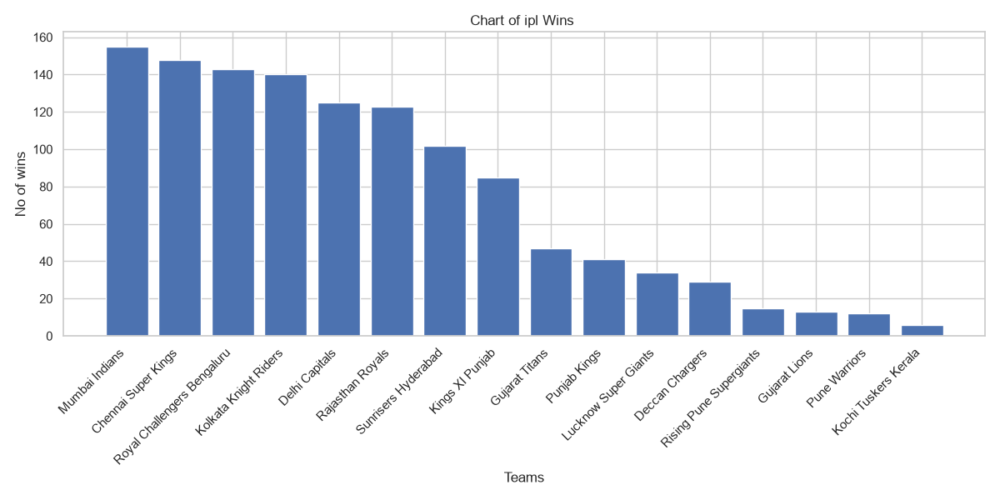
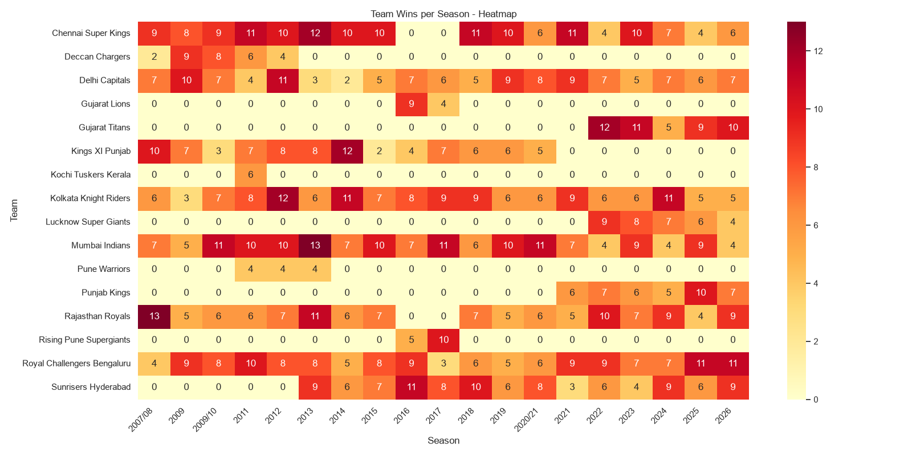
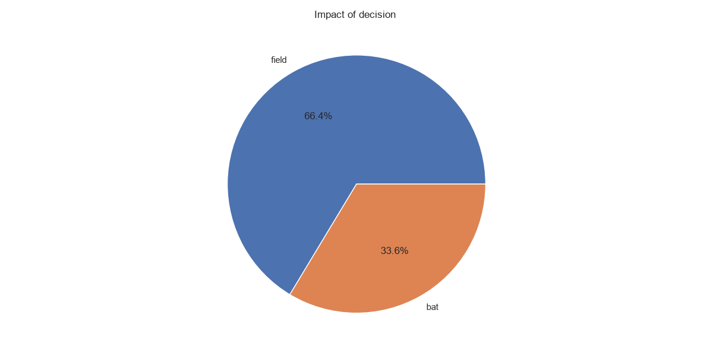
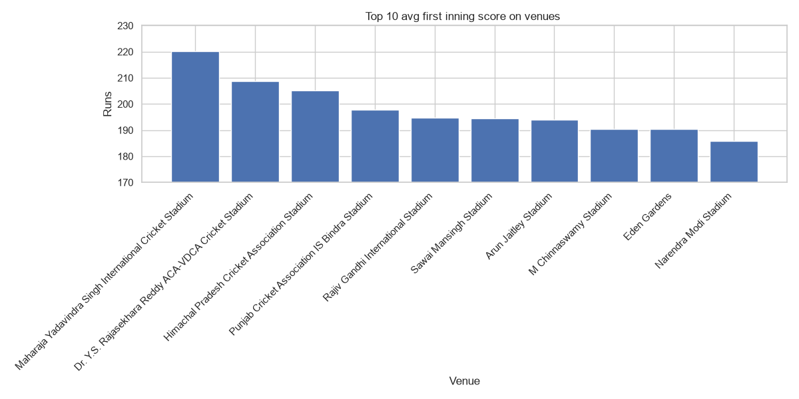
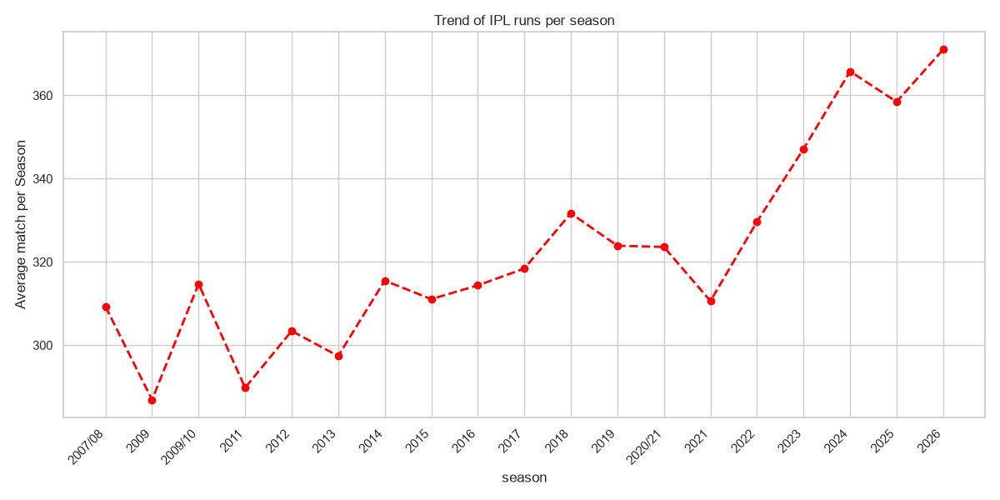
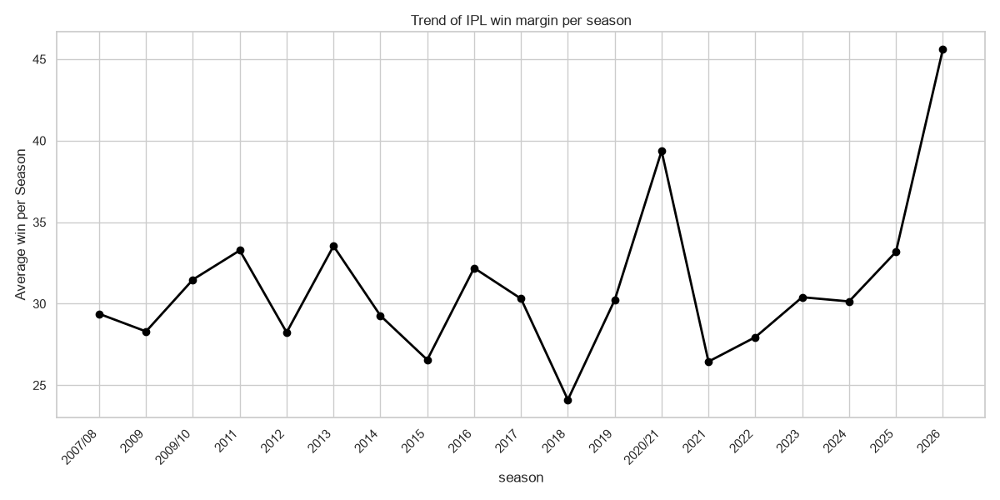
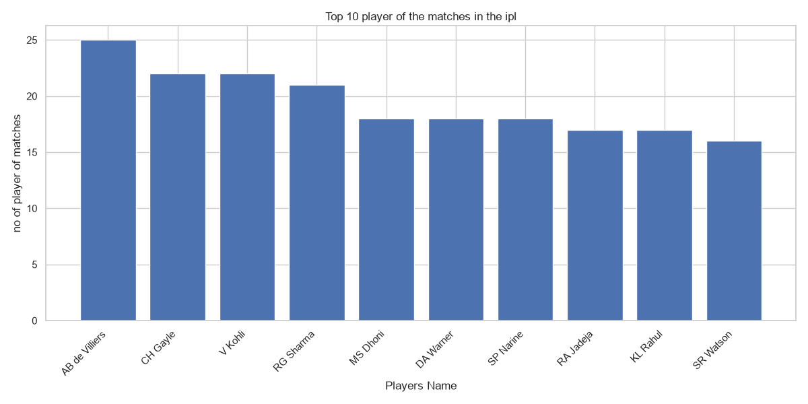

# IPL Match Analyzer

An end-to-end match analysis of every IPL match from 2008-2026, exploring team performance, toss impact, individual brilliance, venue impact, and the recent progression of the game using Python, pandas, matplotlib, and NumPy.


## Key Insights

- IPL scoring has surged since 2022 — average runs per match jumped from ~315 (2021) to ~375+ (2026), reflecting more aggressive batting and shorter boundaries.
- Toss impact in IPL is minimal — only 50.5% of toss winners go on to win the match, barely better than a coin flip. Interestingly, 70% of toss winners chose to field first, suggesting the toss decision matters more than winning the toss itself.
- Venue significantly impacts scoring — stadiums with shorter boundaries (like Maharaja Yadavindra Singh Stadium) average ~220 runs, while larger grounds average notably lower.
- Scoring remained largely stable from 2014 to 2021, but surged by roughly 20% between 2008 and 2026 — driven by factors like the Impact Player rule, flatter pitches, and a shift toward more aggressive modern batting.
- Mumbai Indians lead all-time wins (155), while AB de Villiers holds the most Player of the Match awards (25) — both confirmed through data, not reputation.

## Sample Visualizations









## What This Project Does

The dataset, sourced from Kaggle, covers 1,243 IPL matches from 2008-2026 across 26 columns, including teams, venues, toss decisions, and match outcomes. The raw data contained inconsistent team and city names (e.g., 'Delhi Daredevils' vs 'Delhi Capitals'), which were standardized using pandas. NumPy was used to calculate statistical measures like mean, median, and correlation, while matplotlib and seaborn were used to create 7 visualizations covering team performance, toss impact, venue trends, and scoring patterns over time.

## Tech Stack

- **Python** — core programming language
- **pandas** — data cleaning, filtering, and aggregation
- **NumPy** — statistical calculations (mean, median, correlation)
- **Matplotlib** — bar, pie, and line chart visualizations
- **Seaborn** — heatmap visualization

## How to Run

1. Clone this repository:
```
git clone <your-repo-url>
cd ipl-analyzer
```

2. Create a virtual environment:
```
python -m venv venv
```

3. Activate it:
```
venv\Scripts\activate
```

4. Install dependencies:
```
pip install -r requirements.txt
```

5. Run the script:
```
python main.py
```

## Future Improvements

- **Player-level analysis**: This project is currently match-centric. Adding ball-by-ball data (deliveries.csv) would enable deeper individual player statistics like strike rate, batting average, and bowling economy.
- **Super Over analysis**: The dataset doesn't record Super Over winners separately, so tied matches were excluded from win-count analysis. A dedicated Super Over dataset could resolve this gap.
- **Shot selection trends**: With ball-by-ball data, it would be interesting to analyze the shift toward unconventional shot selection (e.g., leg-side preference) among modern batters compared to earlier eras.